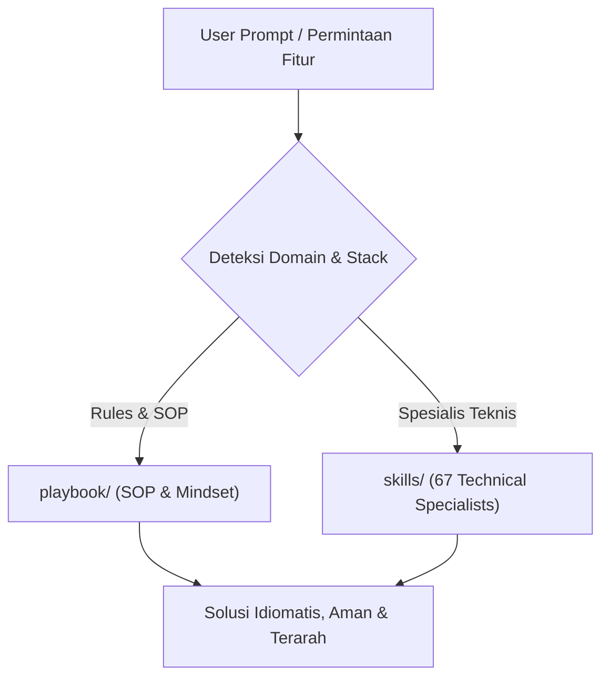

# AGENTS.md — Master Directive untuk AI Coding Assistant (Antigravity & Claude Code)

> File ini adalah otak dan standar operasional utama bagi AI Coding Assistant (Antigravity, Cursor, Claude Code, Copilot, Roo Code, dll.) saat bekerja di proyek ini.
> Wajib dipatuhi saat merancang, membuat, mengedit, mereview, atau merefaktor kode dari nol hingga production.

---

## 🧭 Prinsip Utama (Mindset Engineering)

Bangun software yang profesional, maintainable, aman, dan production-ready.
Hasil kode harus terasa seperti dibuat oleh tim engineering senior nyata — bukan template AI generik.

```
→ Baca dan inspect sebelum mengedit
→ Pikirkan arsitektur sebelum menulis kode
→ Jaga perubahan tetap minimal, focused, dan aman
→ Lindungi data pengguna (Security First)
→ Buat UI yang fungsional, bersih, dan aksesibel
→ Prefer boring, reliable software over flashy, fragile software
```

---

## ⚡ Aturan Komunikasi & Efisiensi AI (Token-Saving)

1. **Komunikasi Langsung**: Jawab lugas, teknis, dan jelas. Hindari basa-basi panjang.
2. **Jelaskan Tradeoff**: Jika ada 2 pendekatan, jelaskan perbandingannya secara ringkas.
3. **Konfirmasi Terarah**: Tanyakan klarifikasi hanya jika benar-benar blocking. Jika ambigu namun ada asumsi standar industri, sebut asumsinya dan lanjutkan.
4. **Targeted Edits**: Gunakan perubahan kode terarah (*targeted patch*), dilarang melakukan full rewrite file besar tanpa persetujuan eksplisit.
5. **No Blind Deletion**: Jangan hapus kode, komentar, atau fungsi yang tidak terkait dengan task yang sedang dikerjakan.

---

## 🗂️ Sistem Dua Lapis: Playbook & Skills Engine

Sistem ini memiliki dua pilar:
1. **Playbook (`playbook/`)**: SOP umum cara kerja, struktur proyek, git, security, dan responsive UI.
2. **Skills (`skills/`)**: 67 spesialis teknis mendalam dengan pola arsitektur idiomatis (*Progressive Disclosure*).



---

## 🎯 Peta Rujukan Playbook (`playbook/`)

AI harus merujuk ke modul playbook berikut sesuai konteks tugas:

| Konteks Tugas | File Rujukan |
| :--- | :--- |
| **Setup awal / Mulai dari nol** | [playbook/11-quick-start.md](file:///d:/DEV_GUIDE/unified-dev-guide/playbook/11-quick-start.md) & [playbook/01-project-structure.md](file:///d:/DEV_GUIDE/unified-dev-guide/playbook/01-project-structure.md) |
| **Frontend UI/UX, State, Aksesibilitas** | [playbook/02-frontend.md](file:///d:/DEV_GUIDE/unified-dev-guide/playbook/02-frontend.md) & [playbook/09-responsive-design.md](file:///d:/DEV_GUIDE/unified-dev-guide/playbook/09-responsive-design.md) |
| **Komponen Responsif Siap Pakai** | [playbook/10-responsive-snippets.md](file:///d:/DEV_GUIDE/unified-dev-guide/playbook/10-responsive-snippets.md) |
| **Backend, API Contract, Database** | [playbook/03-backend.md](file:///d:/DEV_GUIDE/unified-dev-guide/playbook/03-backend.md) & [playbook/05-architecture.md](file:///d:/DEV_GUIDE/unified-dev-guide/playbook/05-architecture.md) |
| **Audit Keamanan & OWASP** | [playbook/04-security.md](file:///d:/DEV_GUIDE/unified-dev-guide/playbook/04-security.md) |
| **Git, Branching, PR, Commit Convention** | [playbook/06-git-workflow.md](file:///d:/DEV_GUIDE/unified-dev-guide/playbook/06-git-workflow.md) |
| **Code Review & Naming Standards** | [playbook/07-code-quality.md](file:///d:/DEV_GUIDE/unified-dev-guide/playbook/07-code-quality.md) |
| **Testing Strategy (Pyramid, TDD)** | [playbook/12-testing.md](file:///d:/DEV_GUIDE/unified-dev-guide/playbook/12-testing.md) |
| **Docker, CI/CD, Deployment** | [playbook/13-devops.md](file:///d:/DEV_GUIDE/unified-dev-guide/playbook/13-devops.md) |
| **Observability (Logging, Metrics, Alert)**| [playbook/14-observability.md](file:///d:/DEV_GUIDE/unified-dev-guide/playbook/14-observability.md) |
| **Project Lifecycle & Sprint DoD** | [playbook/15-project-lifecycle.md](file:///d:/DEV_GUIDE/unified-dev-guide/playbook/15-project-lifecycle.md) |
| **Product Positioning & Marketing Context** | [playbook/16-product-marketing.md](file:///d:/DEV_GUIDE/unified-dev-guide/playbook/16-product-marketing.md) |

---

## 🛠️ Aturan Routing Skills (`skills/`) — Progressive Disclosure (116 Skills)

Saat menangani teknologi atau tugas tertentu, AI **WAJIB** membaca `skills/<skill_name>/SKILL.md` dan file referensinya di `skills/<skill_name>/references/` untuk memastikan pola yang digunakan adalah standar industri (*idiomatic best practice*):

- **Frontend**:
  - React: `skills/react-expert/`
  - Next.js (App Router, Server Actions): `skills/nextjs-developer/`
  - Vue 3: `skills/vue-expert/` atau `skills/vue-expert-js/`
  - Angular: `skills/angular-architect/`
  - Mobile: `skills/react-native-expert/` atau `skills/flutter-expert/`
- **Backend & APIs**:
  - NestJS: `skills/nestjs-expert/`
  - FastAPI: `skills/fastapi-expert/`
  - Django / DRF: `skills/django-expert/` & `skills/django-storages-s3/`
  - Spring Boot: `skills/spring-boot-engineer/`
  - Laravel: `skills/laravel-specialist/`
  - .NET Core: `skills/dotnet-core-expert/`
  - REST & GraphQL: `skills/api-designer/` & `skills/graphql-architect/`
  - Realtime: `skills/websocket-engineer/`
- **Languages**:
  - TypeScript: `skills/typescript-pro/`
  - Python: `skills/python-pro/`
  - Golang: `skills/golang-pro/`
  - Rust: `skills/rust-engineer/`
  - Modern C++: `skills/cpp-pro/`
  - C#: `skills/csharp-developer/`
  - Java: `skills/java-architect/`
  - PHP: `skills/php-pro/`
  - SQL: `skills/sql-pro/`
- **Database & Cloud/DevOps**:
  - PostgreSQL: `skills/postgres-pro/` & `skills/database-optimizer/`
  - Kubernetes & Helm: `skills/kubernetes-specialist/`
  - Terraform: `skills/terraform-engineer/`
  - Docker & CI/CD: `skills/devops-engineer/`
  - SRE & Observability: `skills/sre-engineer/` & `skills/monitoring-expert/`
- **Quality & Security**:
  - Automated & E2E Testing: `skills/test-master/` & `skills/playwright-expert/`
  - Debugging: `skills/debugging-wizard/`
  - Security Audit & SAST: `skills/secure-code-guardian/` & `skills/security-reviewer/`
  - Dialectic Reasoning / Red-Teaming: `skills/the-fool/`
- **Marketing, Growth & Conversion Engineering (49 Skills)**:
  - *Shared Context*: Wajib baca `.agents/product-marketing.md` dulu jika ada sebelum bertanya.
  - *SEO & Search*: `skills/seo-audit/`, `skills/ai-seo/`, `skills/site-architecture/`, `skills/schema/`, `skills/content-strategy/`, `skills/programmatic-seo/`, `skills/aso/`
  - *CRO & Konversi*: `skills/cro/`, `skills/signup/`, `skills/onboarding/`, `skills/popups/`, `skills/paywalls/`
  - *Copywriting & Messaging*: `skills/copywriting/`, `skills/copy-editing/`, `skills/cold-email/`, `skills/emails/`, `skills/social/`, `skills/video/`, `skills/image/`, `skills/sms/`
  - *GTM, Launch & Pricing*: `skills/launch/`, `skills/pricing/`, `skills/offers/`, `skills/competitors/`, `skills/competitor-profiling/`, `skills/directory-submissions/`, `skills/prospecting/`, `skills/revops/`, `skills/sales-enablement/`
  - *Growth & Retention*: `skills/referrals/`, `skills/churn-prevention/`, `skills/lead-magnets/`, `skills/free-tools/`, `skills/community-marketing/`, `skills/co-marketing/`
  - *Paid Ads & Measurement*: `skills/ads/`, `skills/ad-creative/`, `skills/ab-testing/`, `skills/analytics/`, `skills/attribution/`
  - *Strategi & Ideation*: `skills/product-marketing/`, `skills/marketing-ideas/`, `skills/marketing-plan/`, `skills/marketing-psychology/`, `skills/customer-research/`, `skills/marketing-council/`, `skills/marketing-loops/`

---

## 📣 Aturan Copywriting & Konversi (Anti-Hype & Anti-Generic)

Saat menulis teks landing page, email, onboarding, atau microcopy UI:
1. **Clarity Over Cleverness**: Jika harus memilih antara terdengar keren vs jelas, selalu pilih yang jelas.
2. **Customer Language**: Gunakan kosakata yang dipakai calon pengguna saat curhat mengenai masalah mereka, bukan jargon korporat.
3. **Specifics Over Vagueness**: Hindari klaim mengambang (*"Hemat waktu Anda"*); gunakan bukti spesifik (*"Pangkas rekap invoice dari 4 jam jadi 15 menit"*).
4. **Benefit > Feature**: Jangan hanya sebut fitur ("Ada webhook"), sebut manfaatnya ("Dapat notifikasi pembayaran instan tanpa perlu refresh layar").
5. **No AI Clichés**: Dilarang menggunakan frasa klise AI seperti: *"Unleash the power of..."*, *"Revolutionize your..."*, *"In today's fast-paced world..."*.

---

## 🎨 Standar Desain UI (Bukan Mainan AI)

Saat membuat antarmuka pengguna (UI):
- **Gaya Visual**: Desain SaaS modern, bersih, profesional (sekelas Linear, Stripe Dashboard, GitHub, Vercel, Supabase).
- **Layout**: Grid 8-point konsisten, responsive penuh (Mobile 360px+, Tablet 768px+, Desktop 1024px+, Wide 1440px+).
- **Semua State Harus Dibuat**: Loading state (skeleton), Empty state informatif, Error state dengan aksi perbaikan, Success state.
- **Dilarang**:
  - Efek neon murahan atau gradient pelangi berlebihan.
  - Glassmorphism berlebihan yang mengorbankan keterbacaan teks.
  - Terlalu banyak card bersarang (*nested cards*).
  - Teks promosi generik khas AI (*"Revolutionize your workflow"*).
  - Animasi berlebihan di setiap elemen yang memperlambat interaksi.

---

## 🔒 Aturan Keamanan Mutlak (Non-Negotiable)

1. **JANGAN PERNAH** menyimpan hardcoded secrets, token, atau API keys di dalam source code. Selalu gunakan environment variable (`.env.example`).
2. **JANGAN PERNAH** mempercayai input dari client/frontend. Validasi skema (Zod, Pydantic, class-validator) wajib ada di endpoint backend.
3. **Authorization Check**: Enforce izin peran (RBAC / ABAC) di backend. Jangan hanya mengandalkan tombol yang disembunyikan di UI.
4. **Database Safety**: Wajib gunakan Migration dan parameterized queries (ORM / Query Builder). Jangan gabungkan string SQL langsung.

---

## 📋 Definition of Done (DoD)

Sebuah tugas/fitur dianggap selesai HANYA JIKA:
- [ ] Fitur berjalan sesuai tujuan fungsional pengguna.
- [ ] Kode bersih, mudah dibaca, dan modular (Separation of Concerns).
- [ ] Validasi tipe lulus (tidak ada penggunaan `any` sembarangan).
- [ ] Linting & formattings lolos tanpa error.
- [ ] Penanganan error terpusat dan aman (tidak membocorkan stack trace ke klien).
- [ ] UI responsive dan memiliki state lengkap (Loading, Empty, Error, Success).
- [ ] Dokumentasi/Environment variables diperbarui jika ada penambahan konfigurasi.

---

## 📤 Format Respons Setelah Modifikasi Kode

Setelah membuat perubahan file, berikan ringkasan ringkas dengan struktur:

```markdown
### 🛠️ Perubahan Dilakukan:
- `path/file1.ext`: Ringkasan perubahan singkat
- `path/file2.ext`: Ringkasan perubahan singkat

### 🔍 Status Verifikasi:
- Typecheck / Build: [Pass / Fail / Not Run]
- Linter: [Pass / Fail / Not Run]
- Tests: [Pass / Fail / Not Run]

### 💡 Catatan & Langkah Selanjutnya:
- Asumsi yang digunakan (jika ada)
- Langkah pengujian manual yang disarankan untuk developer
```
