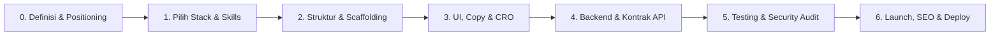

# 🚀 START_HERE.md — Panduan Membangun Proyek dari Nol (0 to 1)

> **Tujuan**: Menghilangkan kebingungan dan proses "muter-muter" saat setup awal atau saat mulai ngoding fitur baru.
> Panduan ini adalah kompas langkah demi langkah agar alur kerja Anda dan Antigravity selalu terarah, efisien, dan berstandar enterprise.

---

## 🗺️ Peta Alur Pengembangan Lengkap (Full Product Lifecycle)



---

## 📌 Fase 0: Klarifikasi Kebutuhan & Positioning Produk (Sebelum Nulis Kode)

Banyak developer langsung ngoding lalu bingung di tengah jalan karena spesifikasi dan positioning produk belum jelas. Luangkan 5-10 menit untuk menetapkan fondasi:

1. **Apa Domain Proyeknya?**
   - *SaaS / B2B*: Multi-tenancy, RBAC, audit log, billing readiness.
   - *E-Commerce*: Katalog, cart, checkout, payment gateway, ongkir, inventory.
   - *Sistem Informasi / Akademik / ERP*: Data master, presensi, rapor, role-based, export PDF/Excel.
   - *Internal Tool / Admin*: Dashboard, CRUD cepat, filter tabel, permission.
2. **Definisikan Positioning Produk (Kunci Sukses Pemasaran)**:
   - Buat file `.agents/product-marketing.md` menggunakan template dari [playbook/16-product-marketing.md](file:///d:/DEV_GUIDE/unified-dev-guide/playbook/16-product-marketing.md).
   - Gunakan skill `skills/product-marketing` dan `skills/offers` untuk merumuskan ICP (*Ideal Customer Profile*), pain points, dan formulasi harga/tawaran.
3. **Mental Checklist Awal (Buka [playbook/11-quick-start.md](file:///d:/DEV_GUIDE/unified-dev-guide/playbook/11-quick-start.md))**:
   - [ ] Sudah tahu entitas data utama?
   - [ ] Sudah tahu authentication flow (JWT, Session, OAuth)?
   - [ ] Sudah siapkan file `.env.example`?

---

## 🛠️ Fase 1: Pemilihan Stack & Aktivasi Skills

Pilih kombinasi teknologi Anda, dan Antigravity akan otomatis mengaktifkan spesialis dari folder `skills/`:

| Tipe Proyek | Rekomendasi Stack | Skills yang Diaktifkan |
| :--- | :--- | :--- |
| **Fullstack Modern (React)** | Next.js (App Router) + PostgreSQL + Prisma/Drizzle | `skills/nextjs-developer`, `skills/postgres-pro`, `skills/react-expert` |
| **Enterprise Backend + SPA** | NestJS (API) + React/Vue (Frontend) + PostgreSQL | `skills/nestjs-expert`, `skills/react-expert`, `skills/api-designer` |
| **Fast Python API** | FastAPI + SQLModel/Asyncpg + Docker | `skills/fastapi-expert`, `skills/python-pro`, `skills/devops-engineer` |
| **Rapid MVP / Monolith** | Laravel / Django + Tailwind | `skills/laravel-specialist` atau `skills/django-expert` |
| **Mobile Cross-Platform** | React Native / Flutter + Supabase | `skills/react-native-expert` atau `skills/flutter-expert` |

---

## 🏗️ Fase 2: Inisialisasi Proyek & Struktur Folder

Gunakan pola folder standar dari [playbook/01-project-structure.md](file:///d:/DEV_GUIDE/unified-dev-guide/playbook/01-project-structure.md). Jangan membuat struktur folder eksperimental yang membingungkan.

### Pola Standar Fullstack / Modular:
```
my-project/
├── .agents/                 ← Konfigurasi & referensi Antigravity
│   └── AGENTS.md            ← Directive utama AI
├── src/
│   ├── modules/ (atau features/)
│   │   ├── auth/            ← Controller, Service, DTO, Components khusus Auth
│   │   ├── users/
│   │   └── products/
│   ├── shared/ (atau common/)
│   │   ├── components/      ← Button, Input, Modal, Card (Reusable)
│   │   ├── hooks/ / utils/  ← Fungsi pembantu
│   │   └── types/           ← Definisi TypeScript global
│   └── config/              ← Environment & constants
├── tests/
├── .env.example
└── README.md
```

---

## 🎨 Fase 3: Frontend, Copywriting & Pondasi Responsif (UI & CRO)

Jangan gunakan template AI murahan yang penuh gradien neon dan sulit dipakai. Gabungkan kekuatan desain bersih dengan teks yang menjual:

1. **Copywriting & CRO (Teks yang Mengonversi)**:
   - Gunakan skill `skills/copywriting` dan `skills/cro` untuk menyusun Headline, Sub-headline, dan tombol CTA.
   - Pahami alur pendaftaran awal menggunakan `skills/signup` dan `skills/onboarding`.
2. **Gunakan 8-Point Grid System** (Spacing 8px, 16px, 24px, 32px).
3. **Desain untuk 4 Layar Sekaligus** (Buka [playbook/09-responsive-design.md](file:///d:/DEV_GUIDE/unified-dev-guide/playbook/09-responsive-design.md)):
   - Mobile (`< 640px`): Single column, full-width buttons, hamburger / bottom nav.
   - Tablet (`640px - 1024px`): 2-column grid, compact sidebar.
   - Desktop (`> 1024px`): Multi-column, expanded sidebar, data tables.
4. **Gunakan Komponen Siap Pakai**: Buka [playbook/10-responsive-snippets.md](file:///d:/DEV_GUIDE/unified-dev-guide/playbook/10-responsive-snippets.md) untuk komponen siap salin (Navbar responsif, Hero section, Metric card, Responsive table).
5. **Wajib 4 State UI**: Setiap tampilan interaktif harus punya: *Loading* (Skeleton), *Empty*, *Error*, dan *Success*.

---

## 🔌 Fase 4: Backend & Kontrak API

Buka [playbook/03-backend.md](file:///d:/DEV_GUIDE/unified-dev-guide/playbook/03-backend.md) dan skill backend terkait:

1. **Validasi Input di Pintu Masuk**:
   - Selalu buat DTO/Schema validasi (Zod di TS, Pydantic di Python, class-validator di NestJS).
   - Jangan pernah mempercayai input form dari frontend.
2. **Format Response Konsisten**:
   ```json
   {
     "success": true,
     "data": { ... },
     "meta": { "page": 1, "total": 100 }
   }
   ```
3. **Database Migration**:
   - Jangan pernah mengubah kolom atau tabel langsung di production tanpa migration script.
   - Gunakan index pada kolom yang sering di-`WHERE` atau di-`JOIN`.

---

## 🛡️ Fase 5: Testing & Audit Keamanan Sebelum Rilis

Sebelum menganggap fitur selesai, lakukan checklist dari [playbook/04-security.md](file:///d:/DEV_GUIDE/unified-dev-guide/playbook/04-security.md) & [playbook/12-testing.md](file:///d:/DEV_GUIDE/unified-dev-guide/playbook/12-testing.md):

- [ ] **OWASP Top 10 Check**: Apakah ada celah SQL injection, XSS, atau insecure direct object reference (IDOR)?
- [ ] **Authorization Check**: Apakah user biasa bisa mengakses endpoint milik admin?
- [ ] **Secrets Check**: Pastikan tidak ada credential yang ter-commit ke Git.
- [ ] **Testing**:
  - Unit test untuk business logic kompleks.
  - Integration test untuk alur endpoint penting (login, transaksi).
  - Panggil skill `skills/playwright-expert` jika membutuhkan E2E browser automation.

---

## 🚢 Fase 6: Launch, SEO, Analytics & Deployment

Buka [playbook/06-git-workflow.md](file:///d:/DEV_GUIDE/unified-dev-guide/playbook/06-git-workflow.md) & [playbook/13-devops.md](file:///d:/DEV_GUIDE/unified-dev-guide/playbook/13-devops.md):

1. **SEO & Discovery Audit**:
   - Jalankan audit metadata, robots.txt, sitemap dengan `skills/seo-audit` dan `skills/schema`.
   - Siapkan strategi pencarian berbasis AI dengan `skills/ai-seo`.
2. **Measurement & Tracking**:
   - Pasang pelacakan konversi dan analitik menggunakan `skills/analytics` dan tool CLI di `tools/clis/`.
3. **Product Launch Checklist**:
   - Susun rencana peluncuran menggunakan `skills/launch` dan `skills/directory-submissions`.
4. **Git & Docker Pipeline**:
   - Conventional Commits (`feat:`, `fix:`, `refactor:`).
   - Pastikan aplikasi memiliki `Dockerfile` multi-stage build yang ringan dan terisolasi.

---

## 💡 Cara Berinteraksi dengan Antigravity (Dev & Marketing)

Gunakan prompt terarah sesuai kebutuhan tahapan Anda:

- **Setup Awal & Arsitektur**:
  > *"Antigravity, ikuti START_HERE.md. Saya ingin membuat SaaS invoicing untuk freelancer dengan Next.js App Router dan PostgreSQL. Tolong bantu rancang Fase 0 (Konteks Produk) dan susun struktur folder Fase 2."*
- **Landing Page & Copywriting Berkonversi Tinggi**:
  > *"Baca `.agents/product-marketing.md`. Aktifkan skill `copywriting` dan `cro` untuk membuatkan copy Hero section dan Pricing table yang persuasif, lalu gabungkan dengan kode Tailwind dari `playbook/10-responsive-snippets.md`."*
- **Audit Keamanan & SEO**:
  > *"Gunakan skill `secure-code-guardian` untuk audit API auth kita, lalu gunakan `seo-audit` untuk memeriksa metadata dan schema markup halaman landing page."*
